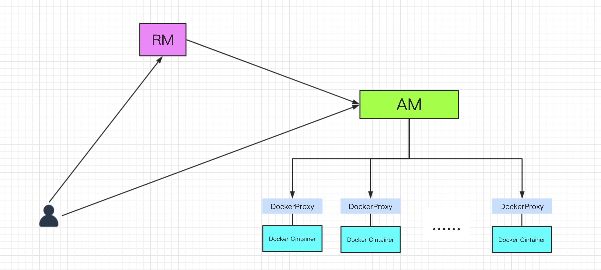
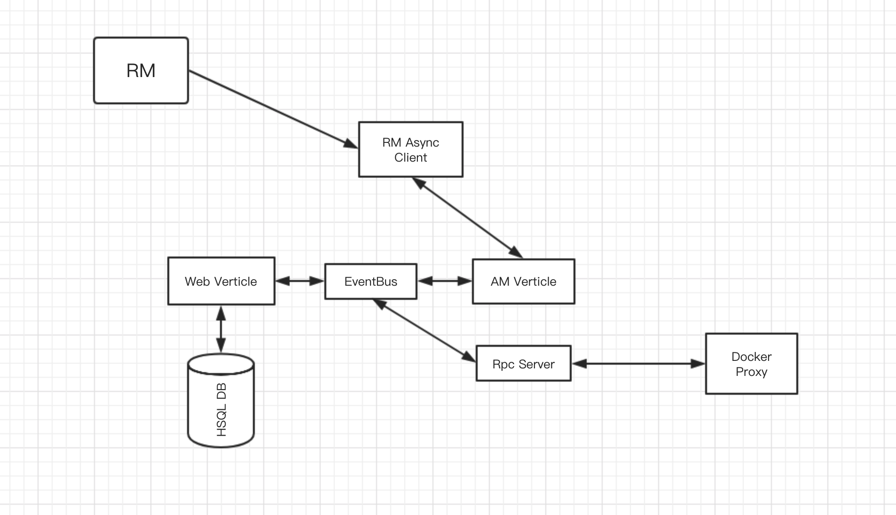

# Thallo
### 1. Thallo是什么？

Thallo是可以使yarn启停Docker容器的Yarn Application。它有以下特点：

+ 可以使yarn调度Docker
+ 可以动态的启停Docker容器
+ 基于Vert.X的异步非阻塞Web服务
+ 提供监控页面，对发布的容器进行管理

------


### 2. Thallo架构

+ 整体结构

### 


Thallo运行于Yarn之上，所有它是典型的yarn app，由ApplicationMaster和DockerProxy组成。AM负责向yarn申请资源，启动DockerProxy。DockerProxy进程启停Docker容器，收集日志。CPU内存等资源的限制交给Docker完成，所有yarn的ContainerExecutor使用DefaultContainerExecutor即可，无需使用LinuxContainerExecutor。DockerProxy进程本身必须只占用很少的资源。

+ AM的结构



AM是基于Vert.X异步非阻塞框架的Web服务。它主要的组件有：

1. Web Verticle: 提供Web服务，访问数据库。
2. AM Vertical： 保存AM的元信息，与RM交互申请资源
3. RpcServer：主要是与DockerProxy通信，保持心跳，传送监控信息。使用的hadoop的RPC框架。

4. 组件之间使用vertx的eventbus解耦。

   

+ DockerProxy


+ 前端

前端开发使用的React框架，数据流层

，采用前后端分离的开发方式。但这种开发方式会导致yarn无法代理前端url，例如原始的css资源url为/index.css,  AM向RM注册时提供追踪url经过yarn代理后的路径变为/proxy/ $(APP_ID)/index.css。也就意味着要想访问到该资源AM返回的html文档中必须动态改变资源的路径，同理ajax的路径也要修改。但前后端分离是没办法动态改变资源的url，导致yarn代理产生404错误。我现在是直接访问AM Web服务，不经过RM，即想RM注册调用registerApplicationMaster接口时不提供appTrackingUrl。

------


### 3. 使用方式

1. 环境准备：

+ 由于Hadoop的依赖包并没有加入Thallo中，客户端要放置Hadoop的安装包，包括配置文件，并配置环境变量HADOOP_HOME指向安装包位置。目前开发采用的Hadoop版本是2.7.4；

+ NodeManager节点安装Docker；

+ 如果yarn是非root用户启动的需要修改docker.sock文件权限：

  ```shell
  chmod o+rw /var/run/docker.sock
  ```

  

2. 启动Thallo

​       1. 在thallo-server目录下执行mvn clean package即可打包。打包完成后在target/thallo/bin目录下有thallo-submit.sh脚本，运行该脚本即可提交Yarn运行Thallo。

```shell
(py2.7) bogon:bin yss$ sh thallo-submit.sh
/Users/yss/work/Thallo/thallo-server/target/thallo
SLF4J: Class path contains multiple SLF4J bindings.
SLF4J: Found binding in [jar:file:/Users/yss/work/Thallo/thallo-server/target/thallo/lib/thallo-hadoop-2.7.3.jar!/org/slf4j/impl/StaticLoggerBinder.class]
SLF4J: Found binding in [jar:file:/opt/hadoop-2.7.4/share/hadoop/common/lib/slf4j-log4j12-1.7.10.jar!/org/slf4j/impl/StaticLoggerBinder.class]
SLF4J: See http://www.slf4j.org/codes.html#multiple_bindings for an explanation.
SLF4J: Actual binding is of type [ch.qos.logback.classic.util.ContextSelectorStaticBinder]
Welcome to

  _____  _             _  _
 |_   _|| |__    __ _ | || |  ___
   | |  | '_ \  / _` || || | / _ \
   | |  | | | || (_| || || || (_) |
   |_|  |_| |_| \__,_||_||_| \___/


[2019-02-02 14:16:01,726] [INFO] [Client.java : 199] Initializing Client
19/02/02 14:16:02 WARN util.NativeCodeLoader: Unable to load native-hadoop library for your platform... using builtin-java classes where applicable
[2019-02-02 14:16:02,547] [INFO] [ClientArguments.java : 57] Application Master's jar is /Users/yss/work/Thallo/thallo-server/target/thallo/lib/thallo-hadoop-2.7.3.jar
19/02/02 14:16:02 INFO impl.TimelineClientImpl: Timeline service address: http://henghe-125:8188/ws/v1/timeline/
19/02/02 14:16:02 INFO client.RMProxy: Connecting to ResourceManager at henghe-125/192.168.101.125:8032
19/02/02 14:16:02 INFO client.AHSProxy: Connecting to Application History server at henghe-125/192.168.101.125:10200
[2019-02-02 14:16:03,127] [INFO] [Client.java : 67] Requesting a new application from cluster with 2 NodeManagers
[2019-02-02 14:16:03,152] [INFO] [Client.java : 75] Got new Application: application_1549088034987_0001
[2019-02-02 14:16:03,468] [INFO] [Client.java : 129] Copying /Users/yss/work/Thallo/thallo-server/target/thallo/lib/thallo-hadoop-2.7.3.jar to remote path hdfs://master/tmp/thallo/staging/application_1549088034987_0001/AppMaster.jar
19/02/02 14:16:04 INFO impl.YarnClientImpl: Submitted application application_1549088034987_0001
```

​    打开Yarn RM的监控页面可以看到有Thallo应用在运行:


注意TrackingUI 不可用，这在前端介绍时已经说明过原因。目前如何获取AM监控监控地址比较麻烦。需要先查到AM的运行主机，在查看AM的日志获取端口，默认端口10321。


查完AM的Web地址后就可以在浏览器打开如下界面：


